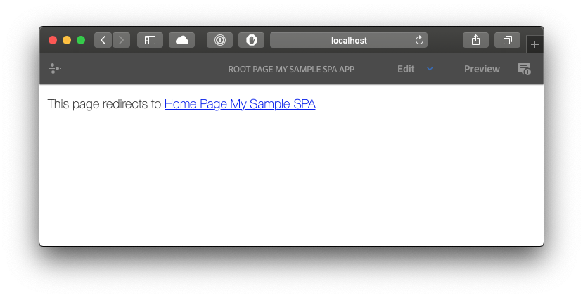
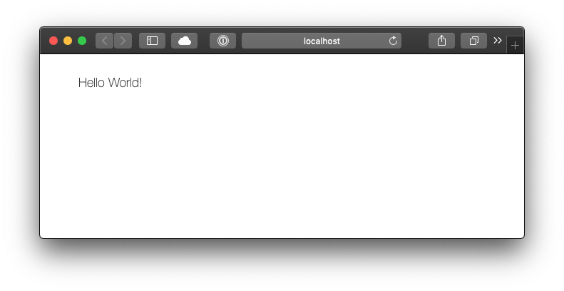
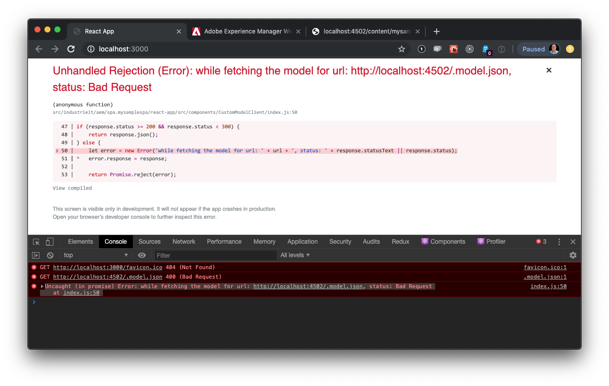
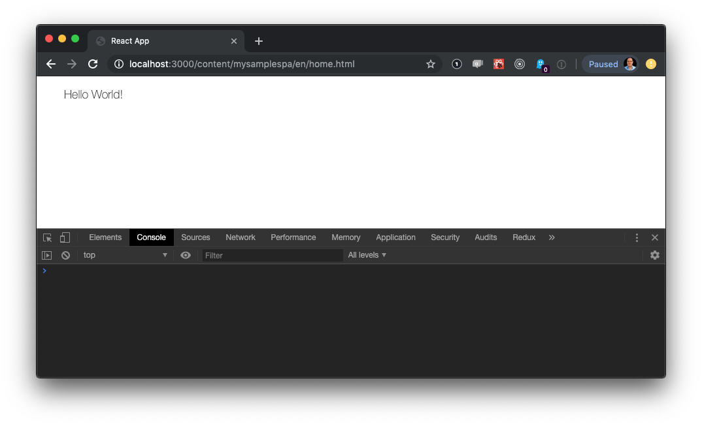

# aem-spa-experiments

Experimenting with Adobe Experience Manager and Single Page Apps

## See Also

- [42 — AEM SPA Editor](https://42.industrieit.com/pages/viewpage.action?spaceKey=Partners&title=AEM+SPA+Editor)
- [Adobe Experience Manager](https://helpx.adobe.com/support/experience-manager/6-5.html)
- [AEM Single Page Editor](https://helpx.adobe.com/experience-manager/kt/eseminars/gems/aem-spa-editor.html) — watch the video. (approx 1 hour)
- [AEM Author in Docker](https://hub.docker.com/r/pawangonnakuti/aem-author)
- [AEM Publish in Docker](https://hub.docker.com/r/pawangonnakuti/aem-publish)
- [SPA Walkthrough](https://helpx.adobe.com/experience-manager/6-5/sites/developing/using/spa-walkthrough.html)
- [AEM Example 'we retail journal'](https://github.com/adobe/aem-sample-we-retail-journal)
- [Maven Archetype for SPA Starter Kit](https://github.com/adobe/aem-spa-project-archetype)

## Run AEM (Authoring and Publishing Environments)

in `/config` create a file called `license.properties` with the following content:

```env
#Adobe Granite License Properties
#Fri May 03 09:28:09 AEST 2019
license.product.name=Adobe Experience Manager
license.customer.name=YOUR NAME GOES HERE
license.product.version=6.5.0
license.downloadID=YOUR LICENSE ID GOES HERE
```

```sh
docker-compose up -d
```

The first time you run these services they'll take a long time (> 5 minutes) to start.

## The services

- [Authoring: localhost:4502](https://localhost:4502)
- [Publishing: localhost:4503](https://localhost:4503)

You can log in to either with `admin` and `admin`

## Development

<!-- prettier-ignore -->
| branch | status | coverage | notes |
| ------ | ------ | -------- | ----- |
| `develop` |  |  | Work in progress |
| `master`  |  |  | Latest stable release |

### Prerequisites

- [NodeJS](https://nodejs.org) version 10.16.3 or better (I use [`nvm`](https://github.com/creationix/nvm) to manage Node versions — `brew install nvm`.)
- [Docker](https://www.docker.com) (Use [Docker for Mac](https://docs.docker.com/docker-for-mac/), not the homebrew version) Set docker's memory to at least 4GB of RAM and 1GB of Swap Space. AEM is a pig.
- [Java](https://www.java.com/en/download/) version 1.8 or better and be sure to set the `JAVA_HOME` environment variable.  To see if it's set check

      echo $JAVA_HOME

  If `JAVA_HOME` is not set then add it to your `~/.zsh_profile` (or whichever shell equivalent you are using)

      export JAVA_HOME=$(/usr/libexec/java_home)

- [Maven](https://maven.apache.org/) `brew install maven`
- [aem-spa-project-archetype](https://github.com/adobe/aem-spa-project-archetype)

  You'll need to `git clone` this to somewhere on your local machine, then `cd` into that directory and build it with

      mvn clean install archetype:update-local-catalog
      mvn archetype:crawl

  **Note**: the install process downloads a few GB of data very slowly from Adobe and can take a half an hour, or more, to complete.

### Building your first Single Page App

We are going to build a `react` app.

Run the maven archetype.

    mvn archetype:generate \
     -DarchetypeCatalog=local \
     -DarchetypeGroupId=com.adobe.cq.spa.archetypes  \
     -DarchetypeArtifactId=aem-spa-project-archetype  \
     -DarchetypeVersion=1.1.0

The script will ask you some questions. For the `groupId` use `spa` and for the `artifactId` use `spa.mysamplespa`.

Then

    cd spa.mysamplespa

The resulting shell of a react app can be found in `spa.mysamplespa/react-app/`

Now, assuming you are running your local versions of AEM Author and Publisher (as per above)

1. Browse to [`localhost:4502/system/console/configMgr`](http://localhost:4502/system/console/configMgr) and log in.
2. Look for the configuration: `Adobe Granite Cross-Origin Resource Sharing Policy`
3. Create a new configuration with the following additional values:

   - Allowed Origins: `http://localhost:3000`
   - Supported Headers: `Authorization`
   - Allowed Methods: `OPTIONS`

### Installing your Single Page App

Check that AEM is running by

1. Check the logs

        docker-compose logs -f

2. Test you can access the apps.

   - [Author: localhost:4502](http://localhost:4502) and log in if necessary.
   - [Publish: localhost:4503](http://localhost:4503) should take you to the default example app.

3. Install the Single Page App into the AEM Author instance

        mvn clean install -PautoInstallSinglePackage

    **Note**: To install the Single Page App into the AEM Publish instance

        mvn clean install -PautoInstallSinglePackagePublish

    **Note**: You can also use the `-Dbuild.environment=":production"` flag to install the production version of the app.

4. Open the app. [localhost:4502/editor.html/content/spa.mysamplespa/en.html](http://localhost:4502/editor.html/content/mysamplespa/en.html)

You should see a page like this:

Use the settings menu at the top left to select 'View as published' and you should get a page like this:

### Running the development server

From within the `spa.mysamplespa/react-app` folder run:

    npm start

This will launch Chrome and take it to `localhost:3000` which, due to a bug in the app, does not actually work (see [github.com/adobe/aem-spa-project-archetype/issues/113](https://github.com/adobe/aem-spa-project-archetype/issues/113)).

Point Chrome at [localhost:3000/content/mysamplespa/en/home.html](http://localhost:3000/content/mysamplespa/en/home.html) instead to see your app.


**Note**: If you don't see anything be sure you set the `CORS` configuration as described above.

### Making changes

You can now develop your app in the same manner as any normal React app.

## Conclusions

Developing SPAs with AEM is very much like trying to strap a Tesla's wheels onto an old Holden and expecting it to become a self-driving electric car.

The development process is slow, resource intensive, buggy, and riddled with security issues.

It's possible to do, and you could get some passable results with a huge amount of effort, but you'd be better off _NOT_ installing the app into AEM but instead using AEM as a headless CMS and just developing a standalone React app that makes REST queries to AEM for content.

- set up is extremely complex (took me several days to get a default app installed and working)
- very resource intensive

  - java
  - maven
  - docker (optional but advised) configured with a minimum of 4GB of RAM

- the default maven app template

  - has many outstanding issues and pull requests in GitHub
  - generates poorly written and buggy code
  - does not follow modern React best practices
  - requires a whole lot of proprietary Adobe libraries which don't appear to have been updated in a while
  - running `npm audit`

        found 1085 vulnerabilities (63 low, 8 moderate, 1012 high, 2 critical) in 37537 scanned packages

- the development process is error prone and overly complex.

## Contributing

Please see the [contributing notes](CONTRIBUTING.md).
